# Функциональная модель системы RecruiteR

## UML Use Case Диаграмма

```mermaid
graph TB
    subgraph Actors[" "]
        Candidate[Кандидат]
        Admin[Администратор]
        Manager[Менеджер вакансий]
        HRBot[HR-бот]
        CoreBot[Core-бот]
        PaymentGateway[Платежный шлюз]
        VideoConf[Видеоконференция]
        Kafka[Kafka]
        Database[База данных]
    end

    subgraph System["Система RecruiteR"]
        subgraph VacancyMgmt["Управление вакансиями"]
            UC1[Создать вакансию]
            UC2[Редактировать вакансию]
            UC3[Просмотреть вакансии]
            UC4[Удалить вакансию]
        end

        subgraph CandidateMgmt["Управление кандидатами"]
            UC5[Зарегистрировать кандидата]
            UC6[Обработать резюме]
            UC7[Распределить кандидата]
            UC8[Просмотреть кандидатов]
            UC9[Обновить статус кандидата]
        end

        subgraph Analysis["Анализ и обработка"]
            UC10[Проанализировать предложение]
            UC11[Сгенерировать контракт]
            UC12[Обработать согласие на данные]
        end

        subgraph Payment["Платежи"]
            UC13[Обработать платеж]
            UC14[Сгенерировать чек]
            UC15[Проверить статус платежа]
        end

        subgraph Video["Видеоконференции"]
            UC16[Создать видеоконференцию]
            UC17[Записать транскрипцию]
            UC18[Просмотреть запись]
        end

        subgraph ManagerMgmt["Управление менеджерами"]
            UC19[Добавить менеджера]
            UC20[Удалить менеджера]
            UC21[Назначить менеджера на вакансию]
        end

        subgraph Stats["Статистика и отчеты"]
            UC22[Просмотреть статистику]
            UC23[Сформировать отчет]
        end

        subgraph Auth["Авторизация"]
            UC24[Авторизоваться]
            UC25[Управлять правами доступа]
        end

        subgraph Data["Хранение данных"]
            UC26[Сохранить данные]
            UC27[Получить данные]
        end

        subgraph Messaging["Обмен сообщениями"]
            UC28[Отправить команду]
            UC29[Получить уведомление]
        end
    end

    %% Связи Кандидата
    Candidate -->|регистрируется| UC5
    Candidate -->|загружает резюме| UC6
    Candidate -->|запрашивает анализ| UC10
    Candidate -->|отзывает согласие| UC12
    Candidate -->|оплачивает услугу| UC13
    Candidate -->|участвует в конференции| UC16
    Candidate -->|авторизуется| UC24

    %% Связи Администратора
    Admin -->|создает| UC1
    Admin -->|редактирует| UC2
    Admin -->|просматривает| UC3
    Admin -->|удаляет| UC4
    Admin -->|просматривает кандидатов| UC8
    Admin -->|добавляет| UC19
    Admin -->|удаляет| UC20
    Admin -->|просматривает статистику| UC22
    Admin -->|формирует отчет| UC23
    Admin -->|авторизуется| UC24
    Admin -->|управляет правами| UC25

    %% Связи Менеджера
    Manager -->|просматривает вакансии| UC3
    Manager -->|просматривает кандидатов| UC8
    Manager -->|обновляет статус| UC9
    Manager -->|просматривает записи| UC18
    Manager -->|авторизуется| UC24

    %% Связи Core-бота
    CoreBot -->|регистрирует кандидата| UC5
    CoreBot -->|обрабатывает резюме| UC6
    CoreBot -->|запрашивает анализ| UC10
    CoreBot -->|генерирует контракт| UC11
    CoreBot -->|обрабатывает согласие| UC12
    CoreBot -->|инициирует платеж| UC13
    CoreBot -->|отправляет команды| UC28
    CoreBot -->|получает уведомления| UC29

    %% Связи HR-бота
    HRBot -->|обрабатывает резюме| UC6
    HRBot -->|обрабатывает согласие| UC12
    HRBot -->|получает команды| UC28
    HRBot -->|отправляет уведомления| UC29

    %% Связи Платежного шлюза
    PaymentGateway -->|обрабатывает платеж| UC13
    PaymentGateway -->|генерирует чек| UC14
    PaymentGateway -->|проверяет статус| UC15
    PaymentGateway -->|сохраняет данные платежей| UC26

    %% Связи Видеоконференции
    VideoConf -->|создает конференцию| UC16
    VideoConf -->|записывает транскрипцию| UC17
    VideoConf -->|предоставляет запись| UC18
    VideoConf -->|сохраняет транскрипции| UC26

    %% Связи Kafka
    Kafka -->|маршрутизирует команды| UC28
    Kafka -->|доставляет уведомления| UC29

    %% Связи Базы данных
    Database -->|сохраняет данные| UC26
    Database -->|предоставляет данные| UC27

    %% Взаимодействия между use cases
    UC6 -.->|запускает распределение| UC7
    UC7 -.->|назначает менеджера| UC21
    UC10 -.->|генерирует контракт| UC11
    UC13 -.->|генерирует чек| UC14
    UC16 -.->|записывает транскрипцию| UC17

    %% Использование базы данных
    UC1 -.->|использует| UC26
    UC5 -.->|использует| UC26
    UC6 -.->|использует| UC26
    UC7 -.->|использует| UC27
    UC8 -.->|использует| UC27
    UC10 -.->|использует| UC26
    UC10 -.->|использует| UC27
    UC22 -.->|использует| UC27

    style Candidate fill:#FFE082
    style Admin fill:#C5E1A5
    style Manager fill:#B39DDB
    style HRBot fill:#FFAB91
    style CoreBot fill:#90CAF9
    style PaymentGateway fill:#A5D6A7
    style VideoConf fill:#F48FB1
    style Kafka fill:#E0E0E0
    style Database fill:#BDBDBD
```

## Описание компонентов

### Акторы (Actors)

1. **Кандидат** - пользователь системы, который регистрируется, загружает резюме и взаимодействует с ботами
2. **Администратор** - управляет вакансиями, менеджерами и просматривает статистику
3. **Менеджер вакансий** - работает с кандидатами по назначенным вакансиям
4. **HR-бот** - автоматизированная обработка резюме и согласий
5. **Core-бот** - основной Telegram бот для взаимодействия с кандидатами
6. **Платежный шлюз** - обработка платежей и генерация чеков
7. **Видеоконференция** - сервис для проведения интервью с записью
8. **Kafka** - система обмена сообщениями между сервисами
9. **База данных** - хранилище всех данных системы

### Основные функции системы

#### Управление вакансиями
- Создание, редактирование, просмотр и удаление вакансий

#### Управление кандидатами
- Регистрация, обработка резюме, распределение между менеджерами, отслеживание статусов

#### Анализ и обработка
- Анализ предложений о работе, генерация контрактов, обработка согласий на обработку данных

#### Платежи
- Обработка платежей, генерация чеков, проверка статусов

#### Видеоконференции
- Создание конференций, запись транскрипций, просмотр записей

#### Управление менеджерами
- Добавление, удаление и назначение менеджеров на вакансии

#### Статистика и отчеты
- Просмотр статистики и формирование отчетов

#### Авторизация
- Вход в систему и управление правами доступа

