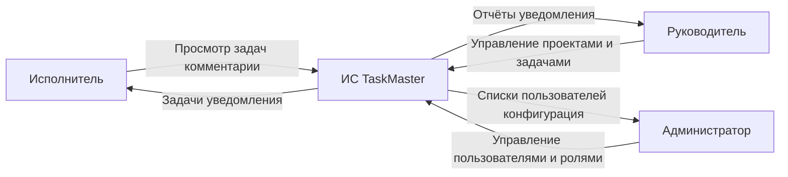
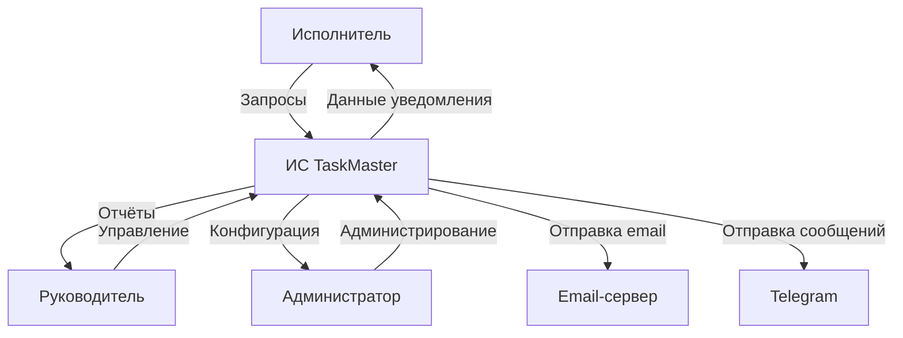
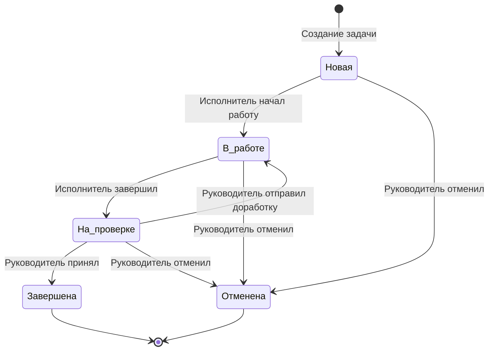

# Сокращённый перечень требований к ИС управления задачами и проектами (TaskMaster)

Документ предназначен для дипломной работы: фиксирует **исходные данные**, **бизнес-цели**, **основные функции**, требования к **контекстным диаграммам**, к **swimlane** (по учебнику, рис. 12-2, с. 272), к **диаграмме переходов состояний** и **таблицам состояний** (рис. 12-3 и 12-4), а также **состав выпусков**.

---

## 1. Исходные данные и цели

### 1.1 Исходные данные (ожидания от приложения)

**Предметная область:** автоматизация управления задачами, проектами и командной работой с использованием веб-интерфейса, ролевой модели и уведомлений.

**Ожидания заказчика/пользователей к информационной системе:**

| Категория | Ожидание |
|-----------|----------|
| Исполнитель (рядовой сотрудник) | Просмотр своих задач, изменение статуса, добавление комментариев, загрузка файлов, получение уведомлений о новых задачах и дедлайнах. |
| Руководитель проекта / менеджер | Создание проектов и задач, назначение исполнителей, установка приоритетов и сроков, контроль выполнения, формирование отчётов по проекту. |
| Администратор системы | Управление пользователями и ролями, просмотр всех проектов, настройка статусов задач, обслуживание системы. |
| Организация | Прозрачность выполнения работ, снижение времени на согласования, единое хранилище проектной документации, масштабируемость. |

**Исходные ограничения и допущения:** использование веб-интерфейса (React/Vue + REST API), реляционная СУБД (PostgreSQL), асинхронная отправка уведомлений (email/Telegram-бот), ролевая модель доступа.

### 1.3 Бизнес-цели

1. **Сократить время управления задачами** за счёт интуитивного интерфейса и быстрых операций изменения статуса.
2. **Повысить прозрачность выполнения проектов** — единое хранение всех задач, сроков, исполнителей и истории изменений.
3. **Обеспечить контроль соблюдения дедлайнов** — автоматические напоминания и уведомления о просроченных задачах.
4. **Снизить нагрузку на руководителей** — делегирование управления задачами через систему, а не через личные сообщения.
5. **Подготовить основу для масштабирования** (поддержка нескольких проектов, команд, ролей).

---

## 2. Основные функции системы

Функции должны быть **отражены на диаграммах** (контекст, декомпозиция, swimlane, состояния). Ниже — оформление по образцу раздела **«2.1. Основные функции»** методички: перечень **FE** и **структурная декомпозиция** от узла «Система …».

### 2.1. Основные функции (перечень функциональных возможностей, FE)

1. **FE-1. Управление проектами:** создание, просмотр, редактирование, архивирование проектов; назначение руководителя проекта.
2. **FE-2. Управление задачами:** создание, просмотр, редактирование, удаление задач; назначение исполнителя, приоритета, срока; прикрепление файлов и комментариев.
3. **FE-3. Изменение статуса задачи:** переход между статусами (новая, в работе, на проверке, завершена, отменена) с фиксацией времени.
4. **FE-4. Уведомления:** отправка исполнителю при назначении задачи; напоминание о приближении дедлайна; уведомление руководителя об изменении статуса.
5. **FE-5. Управление пользователями и ролями:** регистрация, авторизация, назначение ролей (администратор, руководитель, исполнитель), просмотр профиля.
6. **FE-6. Отчёты и статистика:** формирование отчёта по проекту (список задач, исполнители, статусы, отклонение от сроков), сводка по задачам пользователя.
7. **FE-7. Комментарии и обсуждения:** добавление комментариев к задаче, прикрепление файлов, история обсуждений.
8. **FE-8. Доступ к системе:** веб-интерфейс (браузер), REST API для интеграции, при необходимости — Telegram-бот для уведомлений.

### 2.2. Декомпозиция основных функций (структурная диаграмма)

Иерархия в духе **рыбы Исикавы / дерева функций**: от центрального узла **«Система TaskMaster»** — ветви крупных групп и подфункции. В ВКР рисунок воспроизводится в редакторе (Visio, Draw.io). Ниже — **flowchart** (поддерживается GitHub, Mermaid Live).

```mermaid
flowchart TB
  SYS((ИС TaskMaster))

  SYS --> P[Управление проектами]
  P --> P1[Создание проекта]
  P --> P2[Редактирование]
  P --> P3[Архивирование]
  P --> P4[Назначение руководителя]

  SYS --> T[Управление задачами]
  T --> T1[Создание задачи]
  T --> T2[Назначение исполнителя/приоритета/срока]
  T --> T3[Прикрепление файлов]
  T --> T4[Комментарии]

  SYS --> S[Изменение статуса]
  S --> S1[Новая → В работе]
  S --> S2[В работе → На проверке]
  S --> S3[На проверке → Завершена]
  S --> S4[Отмена задачи]

  SYS --> N[Уведомления]
  N --> N1[При назначении задачи]
  N --> N2[О приближении дедлайна]
  N --> N3[Об изменении статуса]

  SYS --> U[Управление пользователями]
  U --> U1[Регистрация/авторизация]
  U --> U2[Назначение ролей]
  U --> U3[Просмотр профиля]

  SYS --> R[Отчёты и статистика]
  R --> R1[Отчёт по проекту]
  R --> R2[Сводка по пользователю]

  SYS --> A[Доступ к системе]
  A --> A1[Веб-интерфейс]
  A --> A2[REST API]
  A --> A3[Telegram-бот]
```

**Соответствие FE и ветвей диаграммы:** FE-1 → «Управление проектами»; FE-2 → «Управление задачами»; FE-3 → «Изменение статуса»; FE-4 → «Уведомления»; FE-5 → «Управление пользователями»; FE-6 → «Отчёты и статистика»; FE-7 → «Комментарии» (часть управления задачами); FE-8 → «Доступ к системе».

### Сводная таблица групп для трассировки на диаграммы (F1–F8)

| № | Группа | Содержание функций | Связь с FE |
|---|--------|-------------------|------------|
| F1 | Управление проектами | Создание, редактирование, архивирование, назначение руководителя. | FE-1 |
| F2 | Управление задачами | CRUD задач, назначение параметров, файлы, комментарии. | FE-2, FE-7 |
| F3 | Статусная модель | Переходы между статусами, фиксация времени. | FE-3 |
| F4 | Уведомления | Email/Telegram-уведомления о событиях. | FE-4 |
| F5 | Пользователи и роли | Регистрация, авторизация, роли (админ, руководитель, исполнитель). | FE-5 |
| F6 | Отчётность | Отчёты по проектам и пользователям. | FE-6 |
| F7 | Интеграционный контур | REST API, Telegram-бот. | FE-8 |
| F8 | Веб-интерфейс | React/Vue-приложение для всех ролей. | FE-8 |

---

## 2.3 Контекстные диаграммы и описание систем

**Требование:** построить **контекстную диаграмму потоков данных (DFD, уровень 0)** и **текстовое описание взаимодействий** в том же формате, что и в методическом примере: одна центральная система (процесс), несколько внешних сущностей, **направленные потоки с подписями** и **связный маркированный текст** под диаграммой.

### Контекстная диаграмма (уровень 0) — состав узлов и потоков

**Центральный процесс (система):** ИС управления задачами и проектами **TaskMaster**.

**Внешние сущности (базовый вариант):**

| Внешняя сущность | Смысл |
|------------------|--------|
| **Исполнитель** | Рядовой сотрудник: просмотр задач, изменение статуса, комментарии, файлы. |
| **Руководитель / менеджер** | Управление проектами и задачами, назначения, контроль, отчёты. |
| **Администратор** | Управление пользователями, ролями, настройка системы. |

**Потоки данных (подписи к стрелкам):**

| От | К | Подпись потока |
|----|---|----------------|
| Исполнитель | ИС TaskMaster | Запросы на просмотр задач, изменение статуса, комментарии, загрузка файлов |
| ИС TaskMaster | Исполнитель | Список задач, уведомления, результаты действий |
| Руководитель | ИС TaskMaster | Создание/редактирование проектов и задач, назначения, запросы отчётов |
| ИС TaskMaster | Руководитель | Данные проектов, отчёты, уведомления об изменениях |
| Администратор | ИС TaskMaster | Управление пользователями, ролями, настройка статусов |
| ИС TaskMaster | Администратор | Списки пользователей, данные аудита, конфигурация |

### Описание системы (текст к контекстной диаграмме)

1. **Исполнитель** через веб-интерфейс просматривает назначенные задачи, изменяет их статус, добавляет комментарии и прикрепляет файлы; система отправляет ему уведомления о новых задачах и дедлайнах.
2. **Руководитель** создаёт и редактирует проекты и задачи, назначает исполнителей и сроки, контролирует выполнение; система предоставляет отчёты и уведомляет об изменениях статусов.
3. **Администратор** управляет пользователями и ролями, настраивает статусы задач; система возвращает списки пользователей и параметры конфигурации.

### Центральная система (состав реализации, внутри контура)

**TaskMaster** — программный комплекс: веб-фронтенд (React/Vue), бэкенд-сервер (REST API), реляционная СУБД (PostgreSQL), сервис уведомлений (email/Telegram-бот). Внутри контура DFD0 не дробится.

### Расширенный вариант контекстной диаграммы (с внешними сервисами)

**Дополнительные внешние сущности (расширенный вариант):**

| Сущность | Роль взаимодействия |
|----------|---------------------|
| **Email-сервер** | SMTP-сервер для отправки email-уведомлений. |
| **Telegram** | Bot API для отправки Telegram-уведомлений. |

---

## Диаграмма переходов состояний и таблицы состояний (ориентир: рис. 12-3 и табл. 12-4)

### Диаграмма переходов (логические состояния задачи)

Рекомендуемая **UML State Machine** (для главы «Поведенческая модель»):

### Таблица состояний (аналог табл. 12-3)

| Код / id | Состояние (имя) | Краткое описание |
|----------|-----------------|------------------|
| 1 | Новая | Задача создана, исполнитель не приступил. |
| 2 | В работе | Исполнитель выполняет задачу. |
| 3 | На проверке | Задача передана руководителю на проверку. |
| 4 | Завершена | Руководитель принял результат. |
| 5 | Отменена | Задача отменена руководителем. |

### Таблица переходов (аналог табл. 12-4)

| Исходное состояние | Событие / триггер | Целевое состояние | Действие системы (кратко) |
|-------------------|-------------------|-------------------|---------------------------|
| Новая | Исполнитель начал работу | В работе | Фиксация времени начала, уведомление руководителя. |
| В работе | Исполнитель завершил | На проверке | Фиксация времени завершения, уведомление руководителя. |
| На проверке | Руководитель принял | Завершена | Фиксация итога, уведомление исполнителя. |
| На проверке | Руководитель отправил доработку | В работе | Уведомление исполнителя с комментарием. |
| Новая / В работе / На проверке | Руководитель отменил | Отменена | Фиксация причины, уведомление исполнителя. |

---

## Связь основных функций с артефактами моделирования

| Функции (разд. 2) | Контекстная диаграмма | Swimlane | Диаграмма состояний |
|-------------------|----------------------|----------|---------------------|
| F1, F2, F6 | Руководитель ↔ система ↔ БД | Управление проектами и задачами | — |
| F3, F4, F7 | Исполнитель ↔ система ↔ БД | Выполнение задачи | Все состояния задачи |
| F5 | Администратор ↔ система | Управление пользователями | — |
| F8 | Все сущности ↔ система | Технические сообщения между дорожками | — |

---

## Состав выпусков (версий) и трек развития ИС

### Выпуск 1 

Цель: демонстрация сквозного сценария и архитектуры.

**Входит в прототип:**

- Бэкенд (REST API) с базовым CRUD проектов и задач.
- Реляционная СУБД (PostgreSQL).
- Веб-фронтенд (React/Vue) для всех ролей.
- Базовая ролевая модель (администратор, руководитель, исполнитель).
- Статусная модель с переходами.
- Уведомления (email/Telegram).
- Простейшие отчёты.

**Прототип сохраняется** как отправная точка; доработки к диплому наращиваются поверх него.

### Выпуск 2

Акцент: **оформление моделей**, **согласованность с кодом**, **качество описания**, при необходимости — закрытие пробелов.

Рекомендуемый состав:

- Контекстная диаграмма и описание систем (разд. 2.3).
- Swimlane по выбранному сценарию (12-2).
- Диаграмма состояний и таблицы 12-3 / 12-4 для статусов задачи.
- Документирование ограничений и известных упрощений прототипа.
- При требовании кафедры: тесты, развёртывание, инструкция пользователя.

### Выпуск 3 и далее

- Промышленная эксплуатация: мониторинг, резервное копирование, безопасность.
- Расширенная аналитика и отчётность (диаграммы Ганта, сгорание задач).
- Интеграция с календарями (Google Calendar, Outlook).
- Мобильное приложение.
- Поддержка нескольких команд и кросс-проектных зависимостей.
- Расширенная настройка статусов и workflow.

